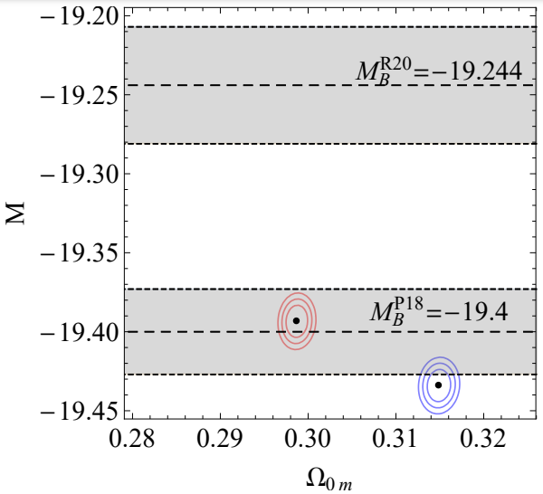

# The Hubble tension, the M crisis of late time H(z) deformation models and the reconstruction of quintessence Lagrangians

This is the repository that contains the Mathematica code as well as useful comments that reproduce the figures of .

## Abstract
We present a detailed and pedagogical analysis of recent cosmological  data including CMB, BAO,  SnIa and the recent local measurement of $H_0$. We thus obtain constraints on the parameters of these standard Dark Energy parametrizations
including ΛCDM, and H(z) deformation models like wCDM (constant equation of state $w$ of  Dark Energy), and the CPL model (corresponding to evolving dark energy equation of state parameter $w(z) = w_0 + w_a \frac{z}{1+z}$). The fitted parameters include the dark matter density $\Omega_{0m}$, the SnIa absolute magnitude M, the Hubble constant $H_0$  and the dark energy parameters (eg w for wCDM). All models considered  lead to a best fit value of M that is inconsistent with the locally determined value obtained by Cepheid calibrators (M tension). We then use the best fit dark energy parameters to reconstruct the quintessence Lagrangian that would be able to reproduce these best fit parametrizations. Due to the derived late phantom behavior of the best fit dark energy equation of state parameter w(z) the reconstructed quintessence models have a negative kinetic term and are therefore plagued with instabilities. 

## Citing the paper 
If you use any of the above codes or the figures in a published work please cite the following paper:
 *The Hubble tension, the M crisis of late time H(z) deformation models and the reconstruction of quintessence Lagrangians*
 Anastasios Theodoropoulos and Leandros Perivolaropoulos, 

Any further questions/comments are welcome.

## Authors List
Anastasios Theodoropoulos - <theodorotasos@gmail.com>
 Leandros Perivolaropoulos - <leandros@uoi.gr>

